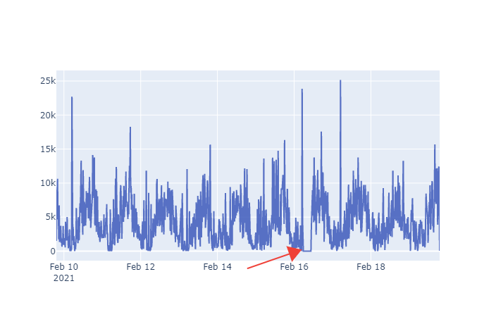

# Anomaly detection

This project use [Prophet](https://facebook.github.io/prophet/) through Python script to detect anomaly from timeseries datasource.

# Use notebook

To requirement to use notebook are:
    - Jupyter notebook or others
        - Python 3
        - all dependencies declared on requirement.txt files

# Anomaly cases

Next sections demonstrate the anomaly detection on different cases.

## Low count

The file data/start-transfers.csv show the number of transfer started. We want to detect the following anomaly:

The notebook for this case is located to notebooks/start-transfers.ipynb.

